# Dependencies

This document lists all external dependencies and system requirements for the Riello UPS Servers Shutdown system.

## Python Version

- **Required**: Python 3.6 or higher
- **Recommended**: Python 3.8+

## Python Dependencies

The system uses **only Python standard library modules** - no external packages are required.

### Server Dependencies (`UPSserver.py`)

| Module | Purpose |
|--------|---------|
| `socket` | UDP/TCP network communication |
| `threading` | Multi-threaded server operations |
| `json` | JSON parsing for UPS API and messages |
| `time` | Timestamps and delays |
| `logging` | Structured logging output |
| `sqlite3` | Database operations |
| `platform` | OS detection for shutdown commands |
| `subprocess` | Executing system shutdown commands |
| `sys` | Standard I/O stream handling |
| `urllib.request` | HTTP requests to UPS API |
| `urllib.error` | HTTP error handling |
| `ssl` | HTTPS connection handling |
| `typing` | Type hints (Dict, Tuple) |
| `datetime` | Timestamp formatting |

### Dashboard Dependencies (`UPSdashboard.py`)

| Module | Purpose |
|--------|---------|
| `sqlite3` | Database read/write operations |
| `json` | JSON API responses |
| `os` | File path operations |
| `http.server` | Built-in HTTP server (HTTPServer, BaseHTTPRequestHandler) |
| `urllib.parse` | URL and query string parsing |
| `datetime` | Date/time formatting |
| `urllib.request` | UPS status fetching |
| `ssl` | HTTPS for UPS API |

### Client Dependencies (`UPSclient.py`)

| Module | Purpose |
|--------|---------|
| `socket` | UDP discovery and TCP connection |
| `threading` | Concurrent heartbeat and message handling |
| `json` | Message serialization/deserialization |
| `time` | Delays and timestamps |
| `random` | Heartbeat jitter calculation |
| `logging` | Structured logging |
| `platform` | OS detection for shutdown commands |
| `subprocess` | Executing shutdown commands |
| `sys` | Standard I/O handling |

## System Requirements

### Operating System Support

| OS | Server | Client | Notes |
|----|--------|--------|-------|
| Linux | ✅ | ✅ | Primary platform, uses `shutdown -h now` |
| macOS | ✅ | ✅ | Uses `shutdown -h now` |
| Windows | ❌ | ✅ | Client uses `shutdown /s /t 0 /f` |

> **Note**: The server is designed to run on Linux with systemd. Windows clients are supported but server deployment on Windows is not recommended.

### Network Requirements

| Port | Protocol | Direction | Purpose |
|------|----------|-----------|---------|
| 5225 | UDP | Inbound/Outbound | Server discovery broadcasts |
| 5226 | TCP | Inbound | Client connections to server |
| 8080 | TCP | Inbound | Dashboard web interface |
| 443 | HTTPS | Outbound | UPS JSON API access |

### Hardware Requirements

#### Server Machine
- Network connectivity to UPS device (same subnet recommended)
- Network connectivity to all client machines
- Sufficient storage for SQLite database and logs
- Stable power source (UPS protected)

#### Client Machines
- Network connectivity to server
- No special hardware requirements

### Permissions

| Component | Required Permission | Reason |
|-----------|---------------------|--------|
| UPSserver | root | Execute system shutdown |
| UPSdashboard | root | Access database in /opt |
| UPSclient | root | Execute system shutdown |

## External Service Dependencies

### Riello UPS JSON API

The system requires a Riello UPS with network connectivity and JSON API support.

**API Endpoint:**
```
https://<UPS_IP>/json/live_data.json
```

**Expected Response Format:**
```json
{
    "autonomy": 120,
    ...
}
```

The `autonomy` field contains the remaining battery time in minutes.

**Connection Requirements:**
- HTTPS (port 443)
- Self-signed certificates are accepted (SSL verification disabled)
- Timeout: 10 seconds

## Optional Dependencies

### Systemd
- **Required for**: Service management, automatic restart, log routing
- **Alternative**: Manual process management or other init systems

### Logrotate
- **Required for**: Automatic log file rotation
- **Alternative**: Manual log management

### SSH (Server Only)
- **Purpose**: Remote pfSense shutdown (optional, site-specific)
- **Configuration**: Requires SSH key at `/root/.ssh/pfsense_id_rsa`

## Dependency Diagram

```mermaid
graph TB
    subgraph "Python Standard Library"
        SOCKET[socket]
        THREADING[threading]
        JSON[json]
        SQLITE[sqlite3]
        HTTP[http.server]
        SSL[ssl]
        URLLIB[urllib]
        SUBPROCESS[subprocess]
        PLATFORM[platform]
        LOGGING[logging]
    end
    
    subgraph "System Services"
        SYSTEMD[systemd]
        LOGROTATE[logrotate]
    end
    
    subgraph "External"
        UPS[Riello UPS API]
    end
    
    SERVER[UPSserver.py] --> SOCKET
    SERVER --> THREADING
    SERVER --> JSON
    SERVER --> SQLITE
    SERVER --> SSL
    SERVER --> URLLIB
    SERVER --> SUBPROCESS
    SERVER --> PLATFORM
    SERVER --> LOGGING
    SERVER --> UPS
    SERVER --> SYSTEMD
    
    DASHBOARD[UPSdashboard.py] --> HTTP
    DASHBOARD --> SQLITE
    DASHBOARD --> JSON
    DASHBOARD --> SSL
    DASHBOARD --> URLLIB
    DASHBOARD --> SYSTEMD
    
    CLIENT[UPSclient.py] --> SOCKET
    CLIENT --> THREADING
    CLIENT --> JSON
    CLIENT --> SUBPROCESS
    CLIENT --> PLATFORM
    CLIENT --> LOGGING
    CLIENT --> SYSTEMD
```



## Version Compatibility

| Component | Minimum Version | Tested With |
|-----------|-----------------|-------------|
| Python | 3.6 | 3.8, 3.9, 3.10, 3.11 |
| SQLite | 3.7 | 3.31+ |
| systemd | 219 | 245+ |
| logrotate | 3.8 | 3.14+ |

---

[← Back to Project Structure](project-structure.md) | [Next: Domain Entities →](../domain/entities.md)
