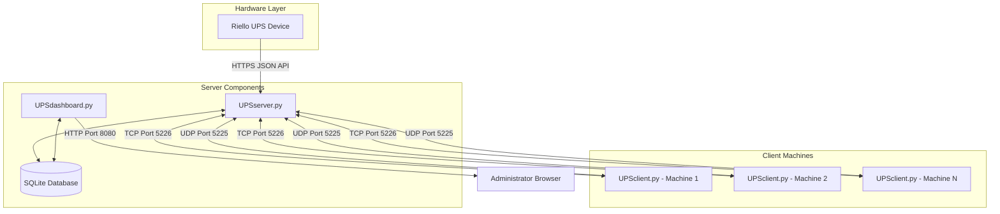
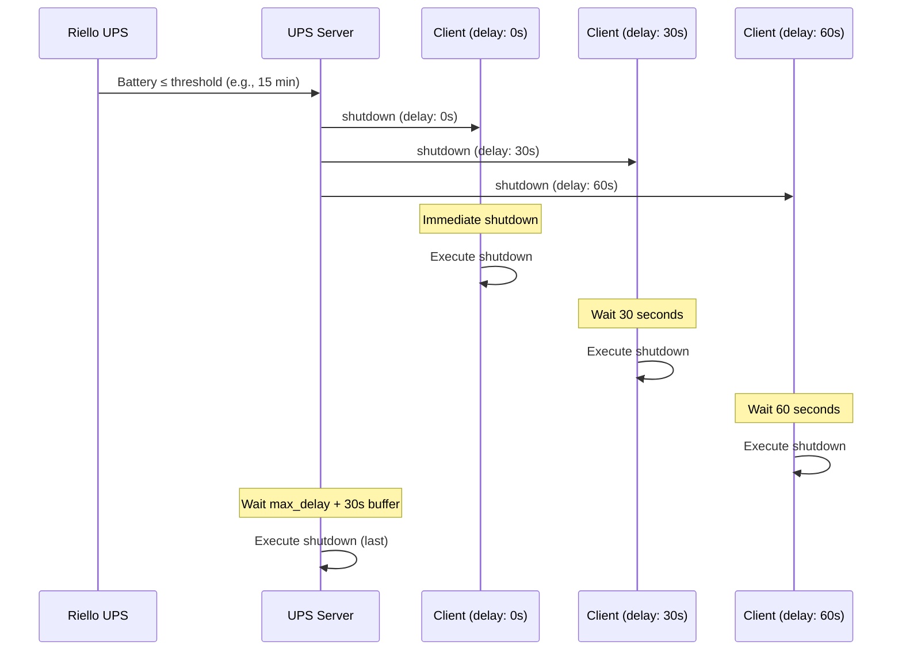

# Architecture Overview

The Riello UPS Servers Shutdown system follows a distributed client-server architecture designed for reliability and automated graceful shutdown of multiple machines during power outages.

## High-Level Architecture



## Component Overview

### 1. UPS Server (`UPSserver.py`)

The central coordination component that:

- **Monitors UPS**: Polls the Riello UPS JSON API every 60 seconds
- **Manages Discovery**: Listens for UDP broadcast discovery requests on port 5225
- **Handles Connections**: Accepts TCP connections from clients on port 5226
- **Tracks Clients**: Maintains connection state and heartbeat timestamps
- **Persists Data**: Stores client info and configuration in SQLite database
- **Coordinates Shutdown**: Sends shutdown commands when battery is critical

**Location**: Should run on the **last machine to be shut down** - typically the main infrastructure server.

### 2. UPS Dashboard (`UPSdashboard.py`)

A web-based management interface that:

- **Displays Status**: Shows connected clients and UPS battery level
- **Enables Configuration**: Allows setting UPS URL and battery threshold
- **Manages Delays**: Provides per-client shutdown delay configuration
- **Auto-Refreshes**: Updates data every 30 seconds

**Port**: 8080 (configurable via command-line argument)

### 3. UPS Client (`UPSclient.py`)

Deployed on each machine requiring automated shutdown:

- **Auto-Discovery**: Uses UDP broadcast to find the server
- **Maintains Connection**: Persistent TCP connection with heartbeats
- **Receives Commands**: Listens for shutdown instructions
- **Executes Shutdown**: Runs OS-appropriate shutdown commands

## Network Architecture

```
┌─────────────────────────────────────────────────────────────────────┐
│                          Network Layer                               │
├─────────────────────────────────────────────────────────────────────┤
│                                                                      │
│   UDP Port 5225 (Broadcast)                                         │
│   ┌─────────────────────────────────────────────────────────────┐   │
│   │  Client → Broadcast: "UPS_DISCOVER"                         │   │
│   │  Server → Client: {"tcp_port": 5226, "server_ip": "x.x.x.x"}│   │
│   └─────────────────────────────────────────────────────────────┘   │
│                                                                      │
│   TCP Port 5226 (Persistent Connection)                             │
│   ┌─────────────────────────────────────────────────────────────┐   │
│   │  Client → Server: {"hostname": "...", "timestamp": ...}     │   │
│   │  Server → Client: {"status": "connected", "message": "..."}  │   │
│   │  Client → Server: {"type": "heartbeat", "timestamp": ...}   │   │
│   │  Server → Client: {"type": "heartbeat_ack"}                 │   │
│   │  Server → Client: {"type": "ups_status", "total_minutes":...}│   │
│   │  Server → Client: {"type": "shutdown", "seconds_to_shutdown"}│   │
│   └─────────────────────────────────────────────────────────────┘   │
│                                                                      │
│   HTTP Port 8080 (Dashboard)                                        │
│   ┌─────────────────────────────────────────────────────────────┐   │
│   │  Browser ↔ Dashboard: REST API for monitoring/config        │   │
│   └─────────────────────────────────────────────────────────────┘   │
│                                                                      │
│   HTTPS (UPS API)                                                   │
│   ┌─────────────────────────────────────────────────────────────┐   │
│   │  Server → UPS: GET /json/live_data.json                     │   │
│   └─────────────────────────────────────────────────────────────┘   │
│                                                                      │
└─────────────────────────────────────────────────────────────────────┘
```

## Threading Model

### UPS Server Threads

| Thread | Purpose | Interval |
|--------|---------|----------|
| Main Thread | Keeps server alive | Continuous |
| UDP Listener | Handles discovery broadcasts | Event-driven |
| TCP Server | Accepts client connections | Event-driven |
| Client Handler | Per-client message handling | Per connection |
| Client Monitor | Detects dead connections | Every 10 seconds |
| UPS Monitor | Polls UPS battery status | Every 60 seconds |

### UPS Client Threads

| Thread | Purpose | Interval |
|--------|---------|----------|
| Main Thread | Keeps client alive | Continuous |
| Discovery Loop | Finds server, manages reconnection | 10-60s backoff |
| Heartbeat Loop | Sends periodic heartbeats | 30-60s (randomized) |
| Message Receiver | Processes server messages | Event-driven |

## Shutdown Sequence



## Design Patterns

### Observer Pattern
The server acts as the subject, broadcasting UPS status updates to all connected client observers.

### Factory Pattern
The `ReadUPSMinutes` class encapsulates UPS data retrieval logic, abstracting the HTTPS JSON API access.

### Singleton Pattern
Each component (server, client, dashboard) is designed to run as a single instance per machine.

### Command Pattern
Shutdown commands are encapsulated as message objects with type, reason, and parameters.

## Security Considerations

- **No Authentication**: The dashboard and server-client communication have no built-in authentication
- **SSL Certificate Bypass**: UPS API access uses `verify_mode = ssl.CERT_NONE` for self-signed certificates
- **Root Privileges**: All services run as root to enable system shutdown commands
- **Network Trust**: System assumes a trusted local network environment

---

[← Back to Documentation Index](../README.md) | [Next: Project Structure →](project-structure.md)
