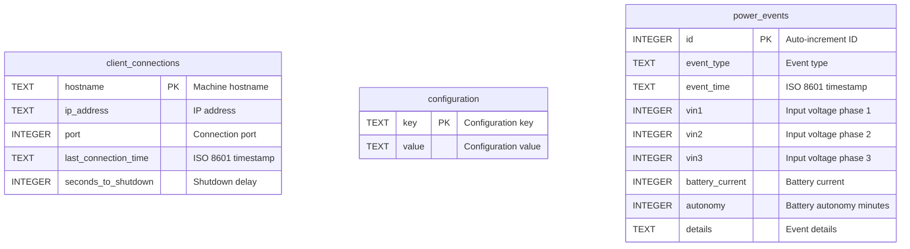

# Database Schema

This document describes the SQLite database schema used by the Riello UPS Servers Shutdown system.

## Database Overview

| Property | Value |
|----------|-------|
| Database Engine | SQLite 3 |
| Database File | `ups_clients.db` |
| Location | `/opt/UPSserver/ups_clients.db` |
| Created By | `UPSserver.py` on first start |
| Access | Read/Write by Server and Dashboard |

## Schema Diagram



---

## Tables

### client_connections

Stores information about client machines that have connected to the server.

**DDL**:
```sql
CREATE TABLE IF NOT EXISTS client_connections (
    hostname TEXT PRIMARY KEY,
    ip_address TEXT,
    port INTEGER,
    last_connection_time TEXT,
    seconds_to_shutdown INTEGER DEFAULT 0
)
```

**Columns**:

| Column | Type | Nullable | Default | Description |
|--------|------|----------|---------|-------------|
| `hostname` | TEXT | No | - | Client machine hostname (Primary Key) |
| `ip_address` | TEXT | Yes | NULL | Client's IP address |
| `port` | INTEGER | Yes | NULL | Client's connection port |
| `last_connection_time` | TEXT | Yes | NULL | ISO 8601 timestamp of last connection |
| `seconds_to_shutdown` | INTEGER | Yes | 0 | Delay before shutdown in seconds |

**Indexes**:
- Primary Key on `hostname`

**Example Data**:
```
hostname          | ip_address     | port  | last_connection_time      | seconds_to_shutdown
------------------|----------------|-------|---------------------------|--------------------
web-server-01     | 192.168.1.101  | 54321 | 2024-01-15T14:30:45.123456| 0
db-server-01      | 192.168.1.102  | 54322 | 2024-01-15T14:30:42.987654| 60
app-server-01     | 192.168.1.103  | 54323 | 2024-01-15T14:30:40.555555| 30
```

---

### configuration

Stores system configuration as key-value pairs.

**DDL**:
```sql
CREATE TABLE IF NOT EXISTS configuration (
    key TEXT PRIMARY KEY,
    value TEXT NOT NULL
)
```

**Columns**:

| Column | Type | Nullable | Default | Description |
|--------|------|----------|---------|-------------|
| `key` | TEXT | No | - | Configuration key name (Primary Key) |
| `value` | TEXT | No | - | Configuration value |

**Indexes**:
- Primary Key on `key`

**Default Configuration Values**:

| Key | Default Value | Description |
|-----|---------------|-------------|
| `UPS_URL` | `https://192.168.155.55/json/live_data.json` | URL to UPS JSON API |
| `UPS_minimum_minutes` | `15` | Battery threshold for shutdown |
| `shutdown_issued` | `false` | Flag indicating if a shutdown was issued (used for recovery mode) |

**Example Data**:
```
key                  | value
---------------------|-----------------------------------------------
UPS_URL              | https://192.168.155.55/json/live_data.json
UPS_minimum_minutes  | 15
shutdown_issued      | false
```

---

### power_events

Stores historical power events including mains power loss/restoration and shutdown initiations.

**DDL**:
```sql
CREATE TABLE IF NOT EXISTS power_events (
    id INTEGER PRIMARY KEY AUTOINCREMENT,
    event_type TEXT NOT NULL,
    event_time TEXT NOT NULL,
    vin1 INTEGER,
    vin2 INTEGER,
    vin3 INTEGER,
    battery_current INTEGER,
    autonomy INTEGER,
    details TEXT
)
```

**Columns**:

| Column | Type | Nullable | Default | Description |
|--------|------|----------|---------|-------------|
| `id` | INTEGER | No | AUTO | Event ID (Primary Key, Auto-increment) |
| `event_type` | TEXT | No | - | Type of event: 'mains_lost', 'mains_restored', 'shutdown_initiated' |
| `event_time` | TEXT | No | - | ISO 8601 timestamp when event occurred |
| `vin1` | INTEGER | Yes | NULL | Input voltage phase 1 (Volts) at time of event |
| `vin2` | INTEGER | Yes | NULL | Input voltage phase 2 (Volts) at time of event |
| `vin3` | INTEGER | Yes | NULL | Input voltage phase 3 (Volts) at time of event |
| `battery_current` | INTEGER | Yes | NULL | Battery current (Amperes, negative=charging, positive=discharging) |
| `autonomy` | INTEGER | Yes | NULL | Battery autonomy (minutes) at time of event |
| `details` | TEXT | Yes | NULL | Additional event details and context |

**Indexes**:
- Primary Key on `id`

**Event Types**:

| Event Type | Description | When Recorded |
|------------|-------------|---------------|
| `mains_lost` | Mains power has been lost | When input voltage drops below threshold or battery starts discharging |
| `mains_restored` | Mains power has been restored | When input voltage returns above threshold or battery starts charging |
| `shutdown_initiated` | System shutdown has been triggered | When shutdown command is issued due to low battery |

**Example Data**:
```
id | event_type         | event_time                 | vin1 | vin2 | vin3 | battery_current | autonomy | details
---|--------------------|-----------------------------|------|------|------|-----------------|----------|------------------
1  | mains_lost         | 2026-03-04T14:30:15.123456 | 0    | 0    | 0    | 45              | 120      | Mains power has been lost, running on battery
2  | mains_restored     | 2026-03-04T14:45:30.654321 | 228  | 227  | 229  | -2              | 118      | Mains power has been restored
3  | shutdown_initiated | 2026-03-04T15:10:00.111222 | 0    | 0    | 0    | 78              | 12       | Shutdown initiated after 5 consecutive low readings...
```

**Usage Notes**:
- Events are automatically recorded by the UPS monitor thread in `UPSserver.py`
- Input voltage below 50V indicates mains power loss
- Positive battery current indicates discharging (on battery)
- Negative battery current indicates charging (mains present)
- Dashboard can query events via `/api/power_events` endpoint

---

## Database Initialization

The database is initialized by `UPSServer._init_database()` on server startup:

```python
def _init_database(self):
    """Initialize the SQLite database for tracking client connections."""
    try:
        conn = sqlite3.connect(self.db_path)
        cursor = conn.cursor()
        
        # Create clients table if it doesn't exist
        cursor.execute('''
            CREATE TABLE IF NOT EXISTS client_connections (
                hostname TEXT PRIMARY KEY,
                ip_address TEXT,
                port INTEGER,
                last_connection_time TEXT,
                seconds_to_shutdown INTEGER DEFAULT 0
            )
        ''')
        
        # Create configuration table if it doesn't exist
        cursor.execute('''
            CREATE TABLE IF NOT EXISTS configuration (
                key TEXT PRIMARY KEY,
                value TEXT NOT NULL
            )
        ''')
        
        # Create power_events table if it doesn't exist
        cursor.execute('''
            CREATE TABLE IF NOT EXISTS power_events (
                id INTEGER PRIMARY KEY AUTOINCREMENT,
                event_type TEXT NOT NULL,
                event_time TEXT NOT NULL,
                vin1 INTEGER,
                vin2 INTEGER,
                vin3 INTEGER,
                battery_current INTEGER,
                autonomy INTEGER,
                details TEXT
            )
        ''')
        
        # Insert default UPS_URL if not exists
        cursor.execute('''
            INSERT OR IGNORE INTO configuration (key, value)
            VALUES ('UPS_URL', ?)
        ''', (UPS_URL,))
        
        # Insert default UPS_minimum_minutes if not exists
        cursor.execute('''
            INSERT OR IGNORE INTO configuration (key, value)
            VALUES ('UPS_minimum_minutes', '15')
        ''')
        
        # Insert default shutdown_issued flag if not exists
        # This flag is set to 'true' just before issuing a shutdown command
        # and is used to detect if we're recovering from a shutdown
        cursor.execute('''
            INSERT OR IGNORE INTO configuration (key, value)
            VALUES ('shutdown_issued', 'false')
        ''')
        
        conn.commit()
        conn.close()
        logger.info(f"Database initialized: {self.db_path}")
    except Exception as e:
        logger.error(f"Failed to initialize database: {e}")
```

---

## Common Queries

### Client Operations

**Insert/Update Client on Connection**:
```sql
-- Check if client exists
SELECT hostname FROM client_connections WHERE hostname = ?

-- Update existing client
UPDATE client_connections 
SET ip_address = ?, port = ?, last_connection_time = ?
WHERE hostname = ?

-- Insert new client
INSERT INTO client_connections (hostname, ip_address, port, last_connection_time)
VALUES (?, ?, ?, ?)
```

**Update Heartbeat Time**:
```sql
UPDATE client_connections 
SET last_connection_time = ?, ip_address = ?, port = ?
WHERE hostname = ?
```

**Get All Clients**:
```sql
SELECT hostname, ip_address, port, last_connection_time, seconds_to_shutdown
FROM client_connections
ORDER BY last_connection_time DESC
```

**Get Specific Client**:
```sql
SELECT hostname, ip_address, port, last_connection_time, seconds_to_shutdown
FROM client_connections
WHERE hostname = ?
```

**Update Shutdown Delay**:
```sql
UPDATE client_connections
SET seconds_to_shutdown = ?
WHERE hostname = ?
```

### Configuration Operations

**Get Configuration Value**:
```sql
SELECT value FROM configuration WHERE key = ?
```

**Set Configuration Value**:
```sql
INSERT OR REPLACE INTO configuration (key, value)
VALUES (?, ?)
```

**Get All Configuration**:
```sql
SELECT key, value FROM configuration ORDER BY key
```

---

## Data Types and Constraints

### Timestamp Format

The `last_connection_time` field stores ISO 8601 formatted timestamps:

```
2024-01-15T14:30:45.123456
```

Generated using Python's `datetime.now().isoformat()`.

### Hostname Constraints

- Must be unique (enforced by PRIMARY KEY)
- Automatically derived from client machine's `platform.node()`
- Case-sensitive

### Shutdown Delay Constraints

- Stored as INTEGER
- Default value: 0
- Valid range: 0 to any positive integer (application logic)
- Dashboard enforces 0-3600 range (0-60 minutes)

---

## Database File Management

### File Location

```
/opt/UPSserver/ups_clients.db
```

### Permissions

```bash
-rw-r--r-- 1 root root 12288 Jan 15 14:30 ups_clients.db
```

### Backup

```bash
# Manual backup
sudo cp /opt/UPSserver/ups_clients.db /opt/UPSserver/ups_clients.db.backup

# With timestamp
sudo cp /opt/UPSserver/ups_clients.db \
    /opt/UPSserver/ups_clients.db.$(date +%Y%m%d_%H%M%S)
```

### Inspection

```bash
# Open SQLite CLI
sudo sqlite3 /opt/UPSserver/ups_clients.db

# View tables
.tables

# View schema
.schema

# Query clients
SELECT * FROM client_connections;

# Query configuration
SELECT * FROM configuration;

# Exit
.quit
```

---

## Thread Safety

SQLite connections are created per-operation in the server code. This ensures thread safety as each thread gets its own connection:

```python
# Each database operation creates a new connection
conn = sqlite3.connect(self.db_path)
cursor = conn.cursor()
# ... perform operations ...
conn.commit()
conn.close()
```

This approach avoids the need for connection pooling while maintaining thread safety.

---

## Migration Notes

The system does not include formal database migrations. Schema changes are handled via:

1. `CREATE TABLE IF NOT EXISTS` - Tables created on first run
2. `INSERT OR IGNORE` - Default values added without overwriting

To add new configuration values or columns, modify `_init_database()` method.

---

[← Back to Service Reference](../services/service-reference.md) | [Next: Data Access →](data-access.md)
