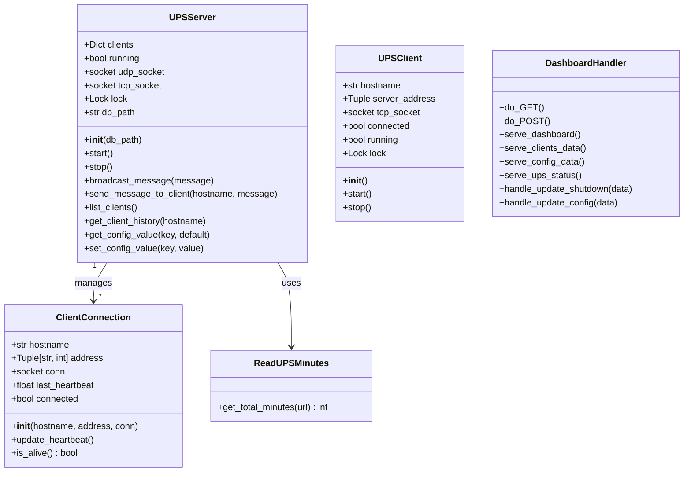

# Domain Entities

This document describes the core data structures and classes used in the Riello UPS Servers Shutdown system.

## Class Diagram



## Server Entities

### ClientConnection

Represents a connected client machine.

**Location**: `server/UPSserver.py`

```python
class ClientConnection:
    """Represents a connected client."""
    
    def __init__(self, hostname: str, address: Tuple[str, int], conn: socket.socket):
        self.hostname = hostname      # Machine hostname
        self.address = address        # (IP, port) tuple
        self.conn = conn              # TCP socket connection
        self.last_heartbeat = time.time()  # Unix timestamp
        self.connected = True         # Connection status flag
```

**Properties:**

| Property | Type | Description |
|----------|------|-------------|
| `hostname` | `str` | The client machine's hostname |
| `address` | `Tuple[str, int]` | IP address and port tuple |
| `conn` | `socket.socket` | Active TCP socket connection |
| `last_heartbeat` | `float` | Unix timestamp of last heartbeat |
| `connected` | `bool` | Whether client is currently connected |

**Methods:**

| Method | Returns | Description |
|--------|---------|-------------|
| `update_heartbeat()` | `None` | Updates `last_heartbeat` to current time |
| `is_alive()` | `bool` | Returns `True` if within heartbeat timeout (90s) |

### ReadUPSMinutes

Utility class for reading battery autonomy from the UPS JSON API.

**Location**: `server/UPSserver.py`

```python
class ReadUPSMinutes:
    """Class to read UPS minutes using direct JSON API access."""
    
    @staticmethod
    def get_total_minutes(url: str) -> Optional[int]:
        """Extract total minutes of autonomy time from UPS JSON API."""
```

**Static Methods:**

| Method | Parameters | Returns | Description |
|--------|------------|---------|-------------|
| `get_total_minutes` | `url: str` | `Optional[int]` | Fetches and parses UPS autonomy value |

**API Response Expected:**
```json
{
    "autonomy": 120
}
```

### UPSServer

The main server class coordinating all UPS monitoring and client management.

**Location**: `server/UPSserver.py`

```python
class UPSServer:
    """Main server class for UPS monitoring system."""
    
    def __init__(self, db_path: str = 'ups_clients.db'):
        self.clients: Dict[str, ClientConnection] = {}
        self.running = False
        self.udp_socket = None
        self.tcp_socket = None
        self.lock = threading.Lock()
        self.db_path = db_path
```

**Properties:**

| Property | Type | Description |
|----------|------|-------------|
| `clients` | `Dict[str, ClientConnection]` | Map of hostname to client connection |
| `running` | `bool` | Server running state |
| `udp_socket` | `socket.socket` | UDP discovery socket |
| `tcp_socket` | `socket.socket` | TCP server socket |
| `lock` | `threading.Lock` | Thread synchronization lock |
| `db_path` | `str` | Path to SQLite database |

**Public Methods:**

| Method | Parameters | Returns | Description |
|--------|------------|---------|-------------|
| `start` | - | `None` | Starts all server threads |
| `stop` | - | `None` | Gracefully stops the server |
| `broadcast_message` | `message: dict` | `None` | Sends message to all clients |
| `send_message_to_client` | `hostname: str, message: dict` | `bool` | Sends message to specific client |
| `list_clients` | - | `List[dict]` | Returns list of connected clients |
| `get_client_history` | `hostname: str = None` | `List[dict]` | Gets client connection history |
| `get_config_value` | `key: str, default: str` | `str` | Retrieves configuration value |
| `set_config_value` | `key: str, value: str` | `None` | Updates configuration value |

## Client Entities

### UPSClient

The main client class for discovering and connecting to the UPS server.

**Location**: `client/UPSclient.py`

```python
class UPSClient:
    """Main client class for UPS monitoring system."""
    
    def __init__(self):
        self.hostname = platform.node()   # Auto-detect hostname
        self.server_address = None        # (IP, port) when discovered
        self.tcp_socket = None            # TCP connection to server
        self.connected = False            # Connection state
        self.running = False              # Client running state
        self.lock = threading.Lock()      # Thread synchronization
```

**Properties:**

| Property | Type | Description |
|----------|------|-------------|
| `hostname` | `str` | Local machine hostname (auto-detected) |
| `server_address` | `Optional[Tuple[str, int]]` | Server IP and port |
| `tcp_socket` | `Optional[socket.socket]` | TCP connection to server |
| `connected` | `bool` | Whether connected to server |
| `running` | `bool` | Client running state |
| `lock` | `threading.Lock` | Thread synchronization lock |

**Public Methods:**

| Method | Parameters | Returns | Description |
|--------|------------|---------|-------------|
| `start` | - | `None` | Starts discovery and connection loop |
| `stop` | - | `None` | Gracefully stops the client |

## Dashboard Entities

### DashboardHandler

HTTP request handler for the web dashboard.

**Location**: `server/UPSdashboard.py`

```python
class DashboardHandler(BaseHTTPRequestHandler):
    """HTTP request handler for the UPS dashboard."""
```

**Inherits from**: `http.server.BaseHTTPRequestHandler`

**Methods:**

| Method | Description |
|--------|-------------|
| `do_GET` | Handles GET requests for pages and API |
| `do_POST` | Handles POST requests for updates |
| `serve_dashboard` | Returns main HTML dashboard |
| `serve_clients_data` | Returns client list as JSON |
| `serve_config_data` | Returns configuration as JSON |
| `serve_ups_status` | Returns current UPS status |
| `handle_update_shutdown` | Updates client shutdown delay |
| `handle_update_config` | Updates configuration value |

## Message Types

### Discovery Messages

**Client Discovery Request (UDP):**
```
UPS_DISCOVER
```

**Server Discovery Response (UDP):**
```json
{
    "tcp_port": 5226,
    "server_ip": "192.168.1.100"
}
```

### Connection Messages

**Client Identification (TCP):**
```json
{
    "hostname": "client-machine-01",
    "timestamp": 1705123456.789
}
```

**Server Welcome (TCP):**
```json
{
    "status": "connected",
    "message": "Welcome to UPS Server"
}
```

### Heartbeat Messages

**Client Heartbeat (TCP):**
```json
{
    "type": "heartbeat",
    "timestamp": 1705123456.789
}
```

**Server Acknowledgment (TCP):**
```json
{
    "type": "heartbeat_ack"
}
```

### Status Messages

**UPS Status Broadcast (TCP):**
```json
{
    "type": "ups_status",
    "total_minutes": 120,
    "timestamp": 1705123456.789
}
```

### Shutdown Messages

**Shutdown Command (TCP):**
```json
{
    "type": "shutdown",
    "reason": "low_power",
    "seconds_to_shutdown": 30,
    "total_minutes": 10,
    "timestamp": 1705123456.789
}
```

---

[← Back to Dependencies](../architecture/dependencies.md) | [Next: Relationships →](relationships.md)
