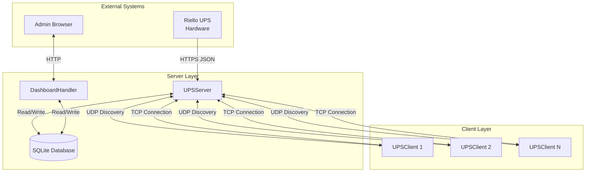
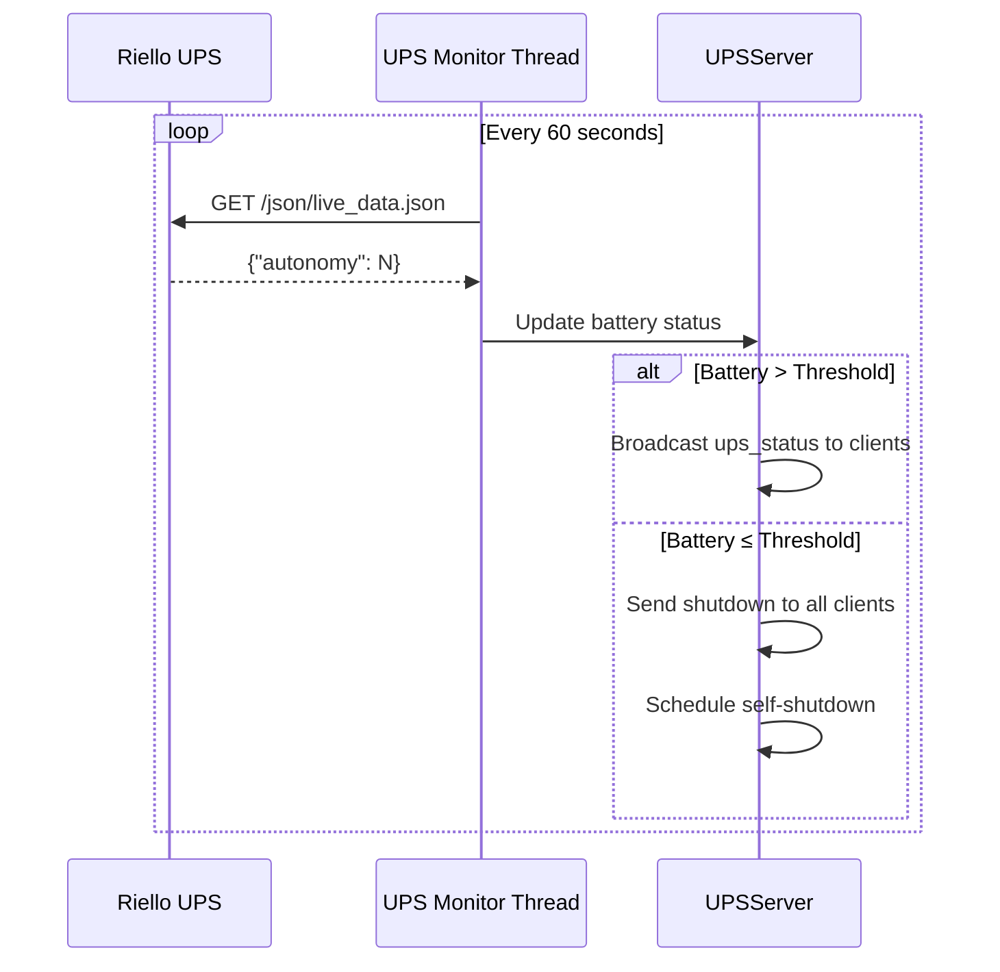
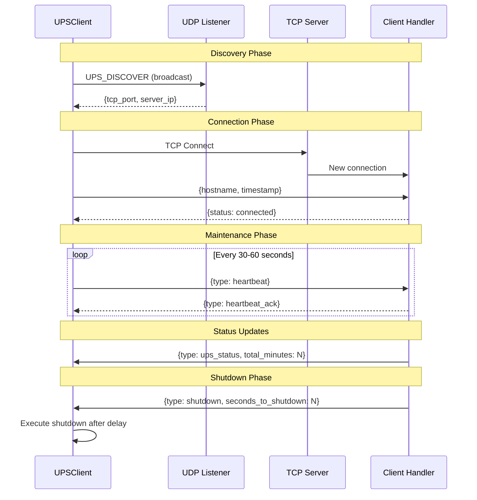
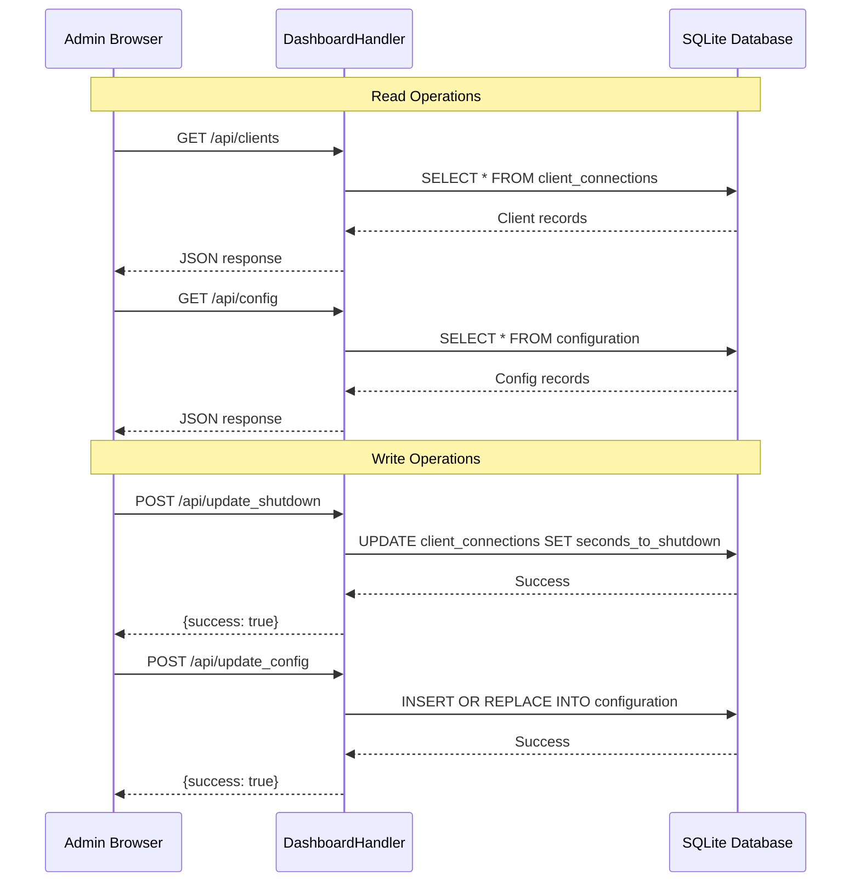
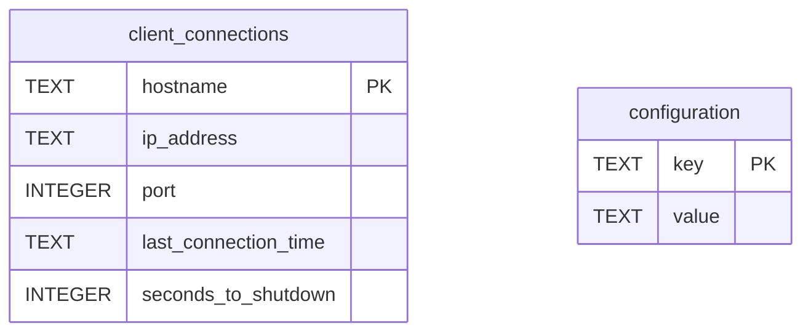
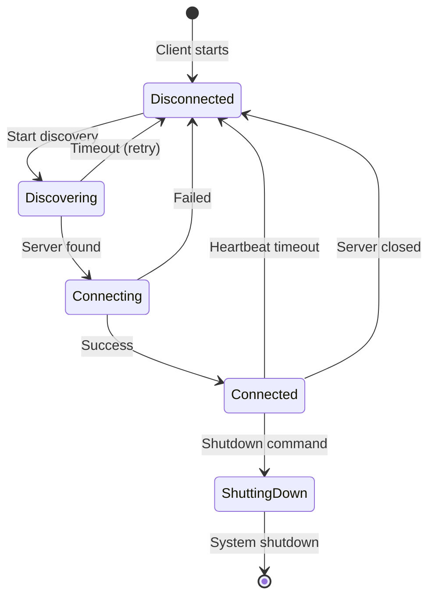
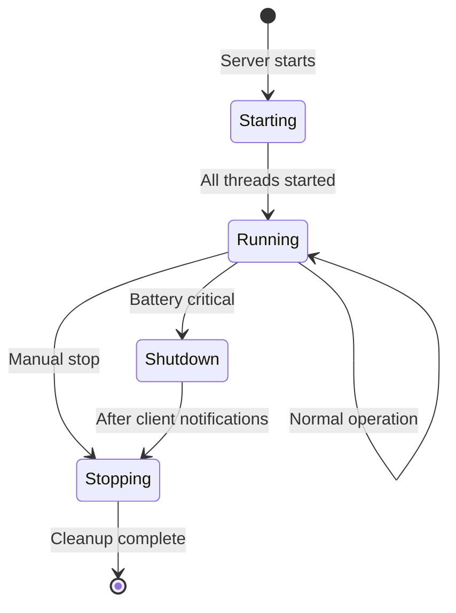

# Entity Relationships

This document describes how the various components and entities in the Riello UPS Servers Shutdown system interact with each other.

## Component Relationship Diagram



## Data Flow Relationships

### 1. UPS → Server Relationship



### 2. Server ↔ Client Relationship



### 3. Dashboard ↔ Database Relationship



## Entity Cardinality

```
┌─────────────────┐     1:N     ┌─────────────────┐
│   UPSServer     │────────────►│ ClientConnection│
└─────────────────┘             └─────────────────┘

┌─────────────────┐     1:1     ┌─────────────────┐
│   UPSServer     │────────────►│ SQLite Database │
└─────────────────┘             └─────────────────┘

┌─────────────────┐     1:1     ┌─────────────────┐
│   UPSClient     │────────────►│   UPSServer     │
└─────────────────┘             └─────────────────┘

┌─────────────────┐     N:1     ┌─────────────────┐
│ DashboardHandler│────────────►│ SQLite Database │
└─────────────────┘             └─────────────────┘
```

## Database Relationships

### Tables and Relationships



### Entity-to-Table Mapping

| Entity | Table | Relationship |
|--------|-------|--------------|
| `ClientConnection` | `client_connections` | Each connected client has a row |
| UPS URL | `configuration` | Stored with key `UPS_URL` |
| Battery Threshold | `configuration` | Stored with key `UPS_minimum_minutes` |

## Thread Relationships

### Server Thread Hierarchy

```
Main Thread
├── UDP Listener Thread
│   └── Handles discovery broadcasts
├── TCP Server Thread
│   └── Client Handler Thread (per client)
│       └── Handles messages for one client
├── Client Monitor Thread
│   └── Checks heartbeat timeouts
└── UPS Monitor Thread
    └── Polls UPS and broadcasts status
```

### Client Thread Hierarchy

```
Main Thread
└── Discovery Loop Thread
    ├── Heartbeat Loop Thread (when connected)
    │   └── Sends periodic heartbeats
    └── Message Receiver Thread (when connected)
        └── Processes server messages
```

## State Relationships

### Connection States



### Server States



## Message Flow Matrix

| From | To | Message Type | Trigger |
|------|-----|--------------|---------|
| Client | Server | `UPS_DISCOVER` | Discovery broadcast |
| Server | Client | Discovery response | Discovery request received |
| Client | Server | Identification | TCP connection established |
| Server | Client | Welcome | Client identified |
| Client | Server | `heartbeat` | Heartbeat interval |
| Server | Client | `heartbeat_ack` | Heartbeat received |
| Server | Clients | `ups_status` | UPS poll (battery OK) |
| Server | Clients | `shutdown` | Battery critical |

## Dependency Injection Points

The system uses minimal dependency injection, primarily through constructor parameters:

| Class | Injectable Dependency | Default Value |
|-------|----------------------|---------------|
| `UPSServer` | `db_path` | `'ups_clients.db'` |
| `DashboardHandler` | None | Uses global `DB_PATH` |
| `UPSClient` | None | No external dependencies |

---

[← Back to Entities](entities.md) | [Next: Business Rules →](business-rules.md)
