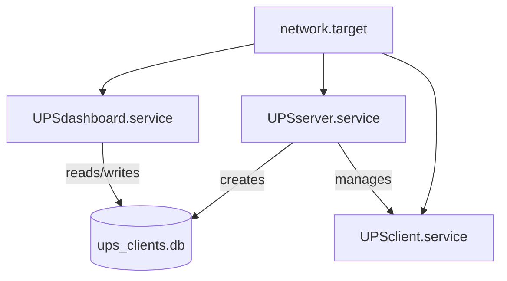

# Service Reference

This document provides a comprehensive reference for all services in the Riello UPS Servers Shutdown system, including their responsibilities, interfaces, and systemd integration.

## Services Overview

| Service | File | Port | Purpose |
|---------|------|------|---------|
| UPS Server | `UPSserver.py` | UDP 5225, TCP 5226 | Core monitoring and coordination |
| UPS Dashboard | `UPSdashboard.py` | TCP 8080 | Web management interface |
| UPS Client | `UPSclient.py` | - | Client-side agent |

---

## UPS Server Service

### Responsibilities

1. **UPS Monitoring**: Poll Riello UPS JSON API every 60 seconds
2. **Client Discovery**: Respond to UDP broadcast discovery requests
3. **Connection Management**: Accept and manage TCP client connections
4. **Data Persistence**: Store client info and configuration in SQLite
5. **Shutdown Coordination**: Send shutdown commands when battery is critical
6. **Self-Shutdown**: Shut down server last after all clients

### Service Architecture

```
┌─────────────────────────────────────────────────────────────┐
│                      UPSServer                               │
├─────────────────────────────────────────────────────────────┤
│  ┌──────────────┐  ┌──────────────┐  ┌──────────────────┐  │
│  │ UDP Listener │  │  TCP Server  │  │ Client Handlers  │  │
│  │   (5225)     │  │   (5226)     │  │  (per client)    │  │
│  └──────────────┘  └──────────────┘  └──────────────────┘  │
│                                                              │
│  ┌──────────────┐  ┌──────────────┐  ┌──────────────────┐  │
│  │   Client     │  │     UPS      │  │     Database     │  │
│  │   Monitor    │  │   Monitor    │  │    Operations    │  │
│  └──────────────┘  └──────────────┘  └──────────────────┘  │
└─────────────────────────────────────────────────────────────┘
```

### Key Methods

| Method | Description |
|--------|-------------|
| `start()` | Initialize and start all server threads |
| `stop()` | Gracefully stop server and close connections |
| `broadcast_message(message)` | Send message to all connected clients |
| `send_message_to_client(hostname, message)` | Send message to specific client |
| `list_clients()` | Get list of currently connected clients |
| `get_client_history(hostname)` | Get connection history from database |
| `get_config_value(key, default)` | Read configuration from database |
| `set_config_value(key, value)` | Write configuration to database |

### Internal Methods

| Method | Thread | Description |
|--------|--------|-------------|
| `_udp_listener()` | UDP Thread | Handle discovery broadcasts |
| `_tcp_server()` | TCP Thread | Accept incoming connections |
| `_handle_client(conn, addr)` | Per-Client Thread | Process client messages |
| `_monitor_clients()` | Monitor Thread | Detect and remove dead clients |
| `_ups_monitor()` | UPS Thread | Poll UPS and broadcast status |
| `_get_server_ip()` | - | Determine server's IP address |
| `_execute_shutdown(seconds)` | - | Execute system shutdown |
| `_record_client_connection(hostname, addr)` | - | Save client to database |
| `_update_heartbeat_time(hostname, addr)` | - | Update last seen time |

### Systemd Service File

**File**: `server/UPSserver.service`

```ini
[Unit]
Description=UPS Server - Monitors UPS and manages client shutdowns
After=network.target network-online.target
Wants=network-online.target

[Service]
Type=simple
User=root
Group=root
WorkingDirectory=/opt/UPSserver

Environment="PATH=/usr/local/bin:/usr/bin:/bin"
Environment="PYTHONUNBUFFERED=1"

StandardOutput=append:/var/log/UPSserver.log
StandardError=append:/var/log/UPSserver_error.log

Restart=always
RestartSec=30

ExecStart=/usr/bin/python3 /opt/UPSserver/UPSserver.py

KillMode=mixed
KillSignal=SIGTERM
TimeoutStopSec=30

[Install]
WantedBy=multi-user.target
```

### Service Management

```bash
# Start service
sudo systemctl start UPSserver.service

# Stop service
sudo systemctl stop UPSserver.service

# Restart service
sudo systemctl restart UPSserver.service

# Check status
sudo systemctl status UPSserver.service

# Enable on boot
sudo systemctl enable UPSserver.service

# Disable on boot
sudo systemctl disable UPSserver.service

# View logs
journalctl -u UPSserver.service -f
```

---

## UPS Dashboard Service

### Responsibilities

1. **Web Interface**: Serve HTML dashboard for monitoring
2. **API Endpoints**: Provide JSON APIs for data access
3. **Configuration**: Allow runtime configuration changes
4. **Client Management**: Display and edit client shutdown delays
5. **UPS Status**: Show real-time battery status

### Service Architecture

```
┌─────────────────────────────────────────────────────────────┐
│                   DashboardHandler                           │
├─────────────────────────────────────────────────────────────┤
│                                                              │
│  ┌──────────────────────────────────────────────────────┐   │
│  │              HTTP Server (Port 8080)                  │   │
│  ├──────────────────────────────────────────────────────┤   │
│  │                                                       │   │
│  │  GET /              → serve_dashboard()              │   │
│  │  GET /api/clients   → serve_clients_data()          │   │
│  │  GET /api/config    → serve_config_data()           │   │
│  │  GET /api/ups_status → serve_ups_status()           │   │
│  │  POST /api/update_shutdown → handle_update_shutdown()│   │
│  │  POST /api/update_config → handle_update_config()    │   │
│  │                                                       │   │
│  └──────────────────────────────────────────────────────┘   │
│                           │                                  │
│                           ▼                                  │
│               ┌──────────────────┐                          │
│               │  SQLite Database │                          │
│               └──────────────────┘                          │
└─────────────────────────────────────────────────────────────┘
```

### Helper Functions

| Function | Description |
|----------|-------------|
| `get_db_connection()` | Create SQLite database connection |
| `load_client_connections()` | Read all clients from database |
| `load_configuration()` | Read all config from database |
| `update_config_value(key, value)` | Update configuration |
| `update_client_shutdown_time(hostname, seconds)` | Update client delay |
| `get_ups_status()` | Fetch current UPS battery status |
| `run_server(port)` | Start HTTP server |

### Systemd Service File

**File**: `server/UPSdashboard.service`

```ini
[Unit]
Description=Python UPSdashboard Service (Streamlit)
After=network.target

[Service]
Type=simple
User=root
Group=root
WorkingDirectory=/opt/UPSserver
ExecStart=/usr/bin/python3 /opt/UPSserver/UPSdashboard.py
Restart=always
RestartSec=30

StandardOutput=append:/var/log/UPSdashboard.log
StandardError=append:/var/log/UPSdashboard_error.log

[Install]
WantedBy=multi-user.target
```

### Service Management

```bash
# Start service
sudo systemctl start UPSdashboard.service

# Stop service
sudo systemctl stop UPSdashboard.service

# Restart service
sudo systemctl restart UPSdashboard.service

# Check status
sudo systemctl status UPSdashboard.service

# Enable on boot
sudo systemctl enable UPSdashboard.service
```

---

## UPS Client Service

### Responsibilities

1. **Server Discovery**: Find UPS server via UDP broadcast
2. **Connection Maintenance**: Maintain persistent TCP connection
3. **Heartbeat**: Send periodic heartbeats to server
4. **Message Processing**: Handle server messages
5. **Shutdown Execution**: Execute system shutdown on command

### Service Architecture

```
┌─────────────────────────────────────────────────────────────┐
│                       UPSClient                              │
├─────────────────────────────────────────────────────────────┤
│                                                              │
│  ┌──────────────────────────────────────────────────────┐   │
│  │               Discovery Loop (Main)                   │   │
│  │                                                       │   │
│  │  1. Broadcast UPS_DISCOVER via UDP                   │   │
│  │  2. Receive server response                          │   │
│  │  3. Connect via TCP                                  │   │
│  │  4. Start heartbeat & receiver threads               │   │
│  │  5. Monitor connection, retry on failure             │   │
│  └──────────────────────────────────────────────────────┘   │
│                           │                                  │
│           ┌───────────────┴───────────────┐                 │
│           ▼                               ▼                 │
│  ┌─────────────────┐            ┌─────────────────┐        │
│  │ Heartbeat Loop  │            │ Message Receiver│        │
│  │ (30-60s jitter) │            │ (Event-driven)  │        │
│  └─────────────────┘            └─────────────────┘        │
│                                          │                  │
│                                          ▼                  │
│                               ┌─────────────────┐          │
│                               │ Message Handler │          │
│                               │ - heartbeat_ack │          │
│                               │ - ups_status    │          │
│                               │ - shutdown      │          │
│                               └─────────────────┘          │
└─────────────────────────────────────────────────────────────┘
```

### Key Methods

| Method | Description |
|--------|-------------|
| `start()` | Start client discovery and connection loop |
| `stop()` | Gracefully stop client |

### Internal Methods

| Method | Description |
|--------|-------------|
| `_discovery_loop()` | Main discovery and reconnection loop |
| `_discover_server()` | Send UDP broadcast and get server info |
| `_connect_to_server()` | Establish TCP connection |
| `_disconnect()` | Clean up connection |
| `_heartbeat_loop()` | Send periodic heartbeats |
| `_receive_messages()` | Process incoming server messages |
| `_handle_message(message)` | Route message to handler |
| `_execute_shutdown(seconds)` | Run system shutdown command |

### Systemd Service File

**File**: `client/UPSclient.service`

```ini
[Unit]
Description=Python UPSclient Service
After=network.target

[Service]
Type=simple
User=root
Group=root
WorkingDirectory=/opt/UPSclient
ExecStart=/usr/bin/python3 /opt/UPSclient/UPSclient.py
Restart=always
RestartSec=30

StandardOutput=append:/var/log/UPSclient.log
StandardError=append:/var/log/UPSclient_error.log

[Install]
WantedBy=multi-user.target
```

### Service Management

```bash
# Start service
sudo systemctl start UPSclient.service

# Stop service
sudo systemctl stop UPSclient.service

# Restart service
sudo systemctl restart UPSclient.service

# Check status
sudo systemctl status UPSclient.service

# Enable on boot
sudo systemctl enable UPSclient.service
```

---

## Log Rotation

All services use logrotate for log management.

### Configuration Example

**File**: `server/UPSserver.logrotate`

```
/var/log/UPSserver.log /var/log/UPSserver_error.log {
    daily
    rotate 7
    size 10M
    maxage 7
    compress
    delaycompress
    missingok
    notifempty
    create 0644 root root
    dateext
    dateformat -%Y%m%d
    extension .log
    
    postrotate
        systemctl reload UPSserver.service > /dev/null 2>&1 || true
    endscript
}
```

### Testing Log Rotation

```bash
# Test configuration
sudo logrotate -d /etc/logrotate.d/UPSserver

# Force rotation
sudo logrotate -f /etc/logrotate.d/UPSserver
```

---

## Service Dependencies



### Startup Order

1. `network.target` - Network becomes available
2. `UPSserver.service` - Start server first (creates database)
3. `UPSdashboard.service` - Start dashboard (needs database)
4. `UPSclient.service` - Start clients (need server)

---

[← Back to Error Handling](../api/error-handling.md) | [Next: Database Schema →](../data/database-schema.md)
